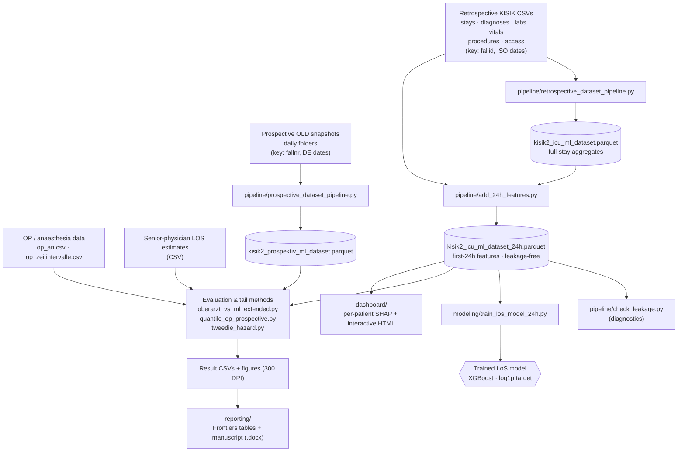

# KISIK ICU Length-of-Stay Prediction

Code for predicting **intensive-care length of stay (LOS)** from the **first 24 hours**
after ICU admission — with strict data-leakage control and a prospective benchmark
against senior-physician estimates. Companion code to the manuscript for the Frontiers
Research Topic *"MedicineAI: Advancing the Synergy of Medicine and AI — From Data to
Clinical Impact."*

> ⚠️ **No patient data is in this repository.** All `.csv` / `.parquet` / `.json` inputs,
> notebooks and generated documents are excluded via `.gitignore`. The scripts expect a
> local KISIK extract (see [Raw data inputs](#raw-data-inputs)).

---

## What happens, with which data, where



---

## Pipeline stages (step by step)

| # | Script | Reads | Produces | What it does |
|---|--------|-------|----------|--------------|
| 1 | `pipeline/retrospective_dataset_pipeline.py` | raw retrospective KISIK CSVs (stays, diagnoses, labs, vitals, procedures, access) | `kisik2_icu_ml_dataset.parquet` | Links all modalities by `fallid`, reconstructs ICU stays/episodes, applies the ward filter, builds the base feature matrix (whole-stay aggregates). |
| 2 | `pipeline/add_24h_features.py` | base parquet + raw lab/vital/procedure/access CSVs | `kisik2_icu_ml_dataset_24h.parquet` | Recomputes labs/vitals/procedures/access **only within the first 24 h** (`planbegin → +24 h`) → `lab24_ / vital24_ / proc24_ / zugang24_` columns. This is the leakage-free dataset. |
| 3 | `pipeline/check_leakage.py`, `check_features_24h.py` | 24h parquet + selected-feature list | console report | Confirms predictors use the 24 h window, not whole-stay summaries; verifies the selected features exist. |
| 4 | `pipeline/prospective_dataset_pipeline.py` | daily OLD live snapshots | `kisik2_prospektiv_ml_dataset.parquet` | Loads each day's snapshot (`pros_load_day_csv`), detects still-open stays (`pros_detect_open_stay`), assembles the prospective dataset. Key `fallnr`, German dates. |
| 5 | `modeling/train_los_model_24h.py` | 24h parquet + `los_selected_features_ain_24h_compact.csv` | trained model + hold-out metrics | Trains the LOS regressor (`TransformedTargetRegressor`, log1p target), patient-level train/test split, then applies it to the prospective dataset. |
| 6 | `modeling/oberarzt_vs_ml_extended.py` | 24h + prospective parquet + senior-estimates CSV | head-to-head CSVs + figures | Trains RF / ExtraTrees / XGBoost / Ridge and benchmarks them against the **senior physician** (matched cohort, Wilcoxon, subgroups, calibration). |
| 7 | `modeling/experiment_op_features.py` | 24h parquet + `op_an.csv` + `op_zeitintervalle.csv` | experiment CSV | Adds perioperative features (ASA, surgery/anaesthesia/bypass time) and tests an asymmetric loss for long-stayers. |
| 8 | `modeling/quantile_op_prospective.py` | retro + prospective + OP files + senior CSV | quantile head-to-head CSVs + figure | XGBoost **quantile** regression (P50/P80) with OP features; prospective benchmark + P80 coverage. |
| 9 | `modeling/tweedie_hazard.py` | retro + prospective + OP + senior CSV | retro/prospective CSVs + figure | **Tweedie/Gamma** objectives and a **discrete-time hazard** model for the long-stay tail. |
| 10 | `reporting/build_frontiers_tables.py`, `build_frontiers_manuscript.py` | result CSVs + figures | `.docx` tables + manuscript | Generates publication-ready Word tables and the manuscript draft. |
| 11 | `dashboard/build_dashboard_data.py` → `build_dashboard_html.py` | 24h parquet + selected features | JSON → standalone HTML | Per-day ward view: predicted LOS per bed + **per-patient SHAP** (XGBoost `pred_contribs`). |

---

## Raw data inputs

Not included — provide a local KISIK extract. Expected tables (linked by case ID):

| Modality | Retrospective file(s) | Prospective source | Notes |
|----------|----------------------|--------------------|-------|
| ICU stays / episodes | stay/episode export | OLD daily snapshot | basis for cohort & target (ICU LOS) |
| Diagnoses (ICD-10) | diagnoses export | OLD snapshot | `diag_main_*` binary features |
| Laboratory | `lab.csv` | OLD snapshot | `lab24_*` (first/mean/min/max/last/count) |
| Vital signs | `vitalzeichen.csv` | OLD snapshot | `vital24_*` (e.g. SpO₂) |
| Procedures (OPS) | `prozeduren.csv` | OLD snapshot | `proc24_*` presence + count |
| Vascular access | `zugaenge.csv` | OLD snapshot | `zugang24_*` presence + count |
| OP / anaesthesia | `op_an.csv`, `op_zeitintervalle.csv` | OLD `op_*` snapshots | ASA, surgery/anaesthesia/HLM-bypass times |
| Senior estimates | senior-estimates CSV (`best_senior_estimate_days`) | — | benchmark for the prospective comparison |

### Key data facts the code relies on
- **Join key differs by cohort:** retrospective `fallid`; prospective/OLD `fallnr`.
  Senior estimates match `tages_stay_id` ↔ prospective `stay_id`.
- **Date formats differ:** retrospective ISO `YYYY-MM-DD HH:MM:SS`; prospective OLD CSVs
  German `DD.MM.YYYY HH:MM:SS` → parse with `COALESCE(TRY_CAST(...), TRY_STRPTIME(..., '%d.%m.%Y %H:%M:%S'))`.
- **Ward filter** tuple order is `(wardshort, oebenekurz)`.
- **Perioperative window** for OP features: `[planbegin − 1 day, planbegin + 24 h]`.
- Paths are hard-coded to a local `D:\Ausgangsdaten\KISIK Projekt` layout — adjust the
  path constants at the top of each script.

---

## Results at a glance

These are the **leakage-controlled** results from the canonical analysis
(`modeling/canonical_analysis.py`, the single source of truth for the manuscript).

| Setting | Finding |
|---------|---------|
| Leakage check | Whole-stay aggregates inflate apparent fit (R² ≈ 0.61); a strict 24 h window removes it and gives R² ≈ 0.31. An earlier pipeline had substituted 15 whole-stay features — that leakage is removed here. |
| Retrospective hold-out (n = 3,429) | All four models near-identical (MAE 2.75–2.94 d; R² 0.23–0.32). Final model by lowest patient-grouped CV-MAE = **Extra Trees** (MAE 2.76 d, R² 0.31); random forest and XGBoost equivalent, Ridge worst. |
| Prospective vs. senior physician (n = 360) | First-24h features **reconstructed from raw prospective data** (86 % available; median per-stay completeness 78 %). **Physician wins overall** (MAE 2.60 vs 3.61 d; R² 0.25 vs 0.07 for the final model). Models carry modest real signal (R² 0.03–0.10); ridge is unstable under distribution shift. |
| Top predictors | Early intensive-care complex-treatment & monitoring procedure codes dominate (permutation importance). |
| Long-stayers (exploratory) | Tweedie (p≈1.3) & discrete-time hazard cut long-stay MAE ~10–12 % and reduce underestimation; quantile-P50 / hazard-median approach the physician on short stays. |

---

## Repository layout

```
pipeline/    data pipelines, 24h feature engineering & leakage diagnostics
  retrospective_dataset_pipeline.py   build retrospective ML dataset from raw CSVs (key: fallid)
  prospective_dataset_pipeline.py     build prospective ML dataset from daily OLD snapshots (key: fallnr)
  add_24h_features.py                 first-24h windowed features (leakage-free)
  check_leakage.py                    leakage diagnostics
  check_features_24h.py               verify selected features exist
modeling/    model training & evaluation
  canonical_analysis.py               SINGLE SOURCE OF TRUTH: leakage-free features, grouped-CV hyperparameter tuning,
                                      consistent 4-model comparison, model selection, permutation importance, figures
  prospective_24h_rebuild.py          rebuild genuine first-24h features for the prospective cohort from raw OLD data; fair senior-physician benchmark + coverage report
  train_los_model_24h.py              earlier notebook-extracted training routine (superseded by canonical_analysis.py)
  oberarzt_vs_ml_extended.py          earlier RF/ExtraTrees/XGBoost/Ridge vs senior comparison
  experiment_op_features.py           OP/anaesthesia features + asymmetric-loss tail model
  quantile_op_prospective.py          quantile (P50/P80) + OP features, prospective head-to-head
  tweedie_hazard.py                   Tweedie/Gamma + discrete-time hazard
figures/     publication figures (matplotlib, 300 DPI)
reporting/   TRIPOD+AI manuscript generator (python-docx)
  build_manuscript_v2.py              builds the manuscript from canonical_analysis.py outputs
dashboard/   interactive per-day ward dashboard with per-patient SHAP
```

> `modeling/canonical_analysis.py` produces all reported metrics, the feature-importance
> table and the figures; `reporting/build_manuscript_v2.py` then assembles the manuscript.
> The earlier `modeling/oberarzt_vs_ml_extended.py` contained a leaky feature fallback
> (whole-stay substitution) and is kept only for provenance — do not cite its numbers.

---

## Requirements & how to run

Python 3.12 — `pip install -r requirements.txt`
(`duckdb`, `xgboost>=2.0`, `scikit-learn`, `scipy`, `pandas`, `numpy`, `matplotlib`, `python-docx`, `Pillow`).

```bash
# 1) build datasets
python pipeline/retrospective_dataset_pipeline.py
python pipeline/add_24h_features.py
python pipeline/prospective_dataset_pipeline.py
python pipeline/check_leakage.py
# 2) canonical analysis (source of truth): tuning, model selection, metrics, importance, figures
python modeling/canonical_analysis.py
#    fair prospective benchmark (rebuilds genuine 24h features for the prospective cohort)
python modeling/prospective_24h_rebuild.py
#    optional exploratory analyses
python modeling/quantile_op_prospective.py
python modeling/tweedie_hazard.py
# 3) manuscript + dashboard
python reporting/build_manuscript_v2.py
python dashboard/build_dashboard_data.py
python dashboard/build_dashboard_html.py
```

> The two extracted pipeline files (`retrospective_/prospective_dataset_pipeline.py`)
> and `train_los_model_24h.py` are source-only extracts of the original Jupyter notebooks
> (`# %% [cell N]` markers, shared state, top-to-bottom execution). Complete as
> documentation/reference; for a clean script run, adjust paths and cell order.

---

## Privacy & ethics

This repository contains **only code**. Never commit patient-level data. Any sharing of
model outputs requires the originating institution's ethics approval and data-protection
clearance. Before public release, add a license and complete the manuscript's
author / affiliation / ethics fields.
