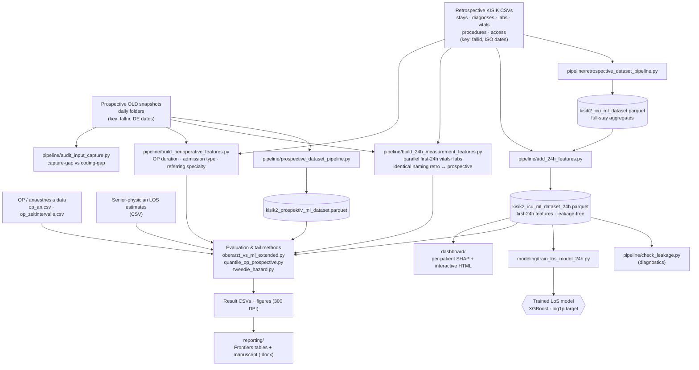

# KISIK ICU Length-of-Stay Prediction

Code for predicting **intensive-care length of stay (LOS)** from the **first 24 hours**
after ICU admission — with strict data-leakage control and a prospective benchmark
against senior-physician estimates. Companion code to the manuscript for the Frontiers
Research Topic *"MedicineAI: Advancing the Synergy of Medicine and AI — From Data to
Clinical Impact."*

> ⚠️ **No patient data is in this repository.** All `.csv` / `.parquet` / `.json` inputs,
> notebooks and generated documents are excluded via `.gitignore`. The scripts expect a
> local KISIK extract (see [Raw data inputs](#raw-data-inputs)).

---

## What happens, with which data, where


```mermaid
flowchart TD
    R1["Retrospective KISIK CSVs<br/>stays · diagnoses · labs · vitals<br/>procedures · access<br/>(key: fallid, ISO dates)"]
    R2["OP / anaesthesia data<br/>op_an.csv · op_zeitintervalle.csv"]
    P1["Prospective OLD snapshots<br/>daily folders<br/>(key: fallnr, DE dates)"]
    S1["Senior-physician LOS estimates<br/>(CSV)"]

    R1 --> A["pipeline/retrospective_dataset_pipeline.py"]
    A --> D1[("kisik2_icu_ml_dataset.parquet<br/>full-stay aggregates")]
    D1 --> B["pipeline/add_24h_features.py"]
    R1 --> B
    B --> D2[("kisik2_icu_ml_dataset_24h.parquet<br/>first-24h features · leakage-free")]
    D2 --> L["pipeline/check_leakage.py<br/>(diagnostics)"]

    P1 --> C["pipeline/prospective_dataset_pipeline.py"]
    C --> D3[("kisik2_prospektiv_ml_dataset.parquet")]

    R1 --> MR["pipeline/build_24h_measurement_features.py<br/>parallel first-24h vitals+labs<br/>identical naming retro ↔ prospective"]
    P1 --> MR
    R1 --> POF["pipeline/build_perioperative_features.py<br/>OP duration · admission type · referring specialty"]
    P1 --> POF
    P1 --> AUD["pipeline/audit_input_capture.py<br/>capture-gap vs coding-gap"]
    MR --> CMP
    POF --> CMP

    D2 --> T["modeling/train_los_model_24h.py"]
    T --> M{{"Trained LoS model<br/>XGBoost · log1p target"}}

    D2 --> CMP["Evaluation & tail methods<br/>oberarzt_vs_ml_extended.py<br/>quantile_op_prospective.py<br/>tweedie_hazard.py"]
    D3 --> CMP
    R2 --> CMP
    S1 --> CMP

    CMP --> O1["Result CSVs + figures (300 DPI)"]
    O1 --> REP["reporting/<br/>Frontiers tables + manuscript (.docx)"]
    D2 --> DASH["dashboard/<br/>per-patient SHAP + interactive HTML"]
```

---

## Pipeline stages (step by step)

| # | Script | Reads | Produces | What it does |
|---|--------|-------|----------|--------------|
| 1 | `pipeline/retrospective_dataset_pipeline.py` | raw retrospective KISIK CSVs (stays, diagnoses, labs, vitals, procedures, access) | `kisik2_icu_ml_dataset.parquet` | Links all modalities by `fallid`, reconstructs ICU stays/episodes, applies the ward filter, builds the base feature matrix (whole-stay aggregates). |
| 2 | `pipeline/add_24h_features.py` | base parquet + raw lab/vital/procedure/access CSVs | `kisik2_icu_ml_dataset_24h.parquet` | Recomputes labs/vitals/procedures/access **only within the first 24 h** (`planbegin → +24 h`) → `lab24_ / vital24_ / proc24_ / zugang24_` columns. This is the leakage-free dataset. |
| 3 | `pipeline/check_leakage.py`, `check_features_24h.py` | 24h parquet + selected-feature list | console report | Confirms predictors use the 24 h window, not whole-stay summaries; verifies the selected features exist. |
| 4 | `pipeline/prospective_dataset_pipeline.py` | daily OLD live snapshots | `kisik2_prospektiv_ml_dataset.parquet` | Loads each day's snapshot (`pros_load_day_csv`), detects still-open stays (`pros_detect_open_stay`), assembles the prospective dataset. Key `fallnr`, German dates. |
| 4b | `pipeline/build_24h_measurement_features.py` | retro CSVs **and** OLD snapshots | `vital24_* / lab24_*` per cohort | Rebuilds first-24h **vitals + labs** identically on both sides (`sanitise()` naming), so the prospective matrix captures the same measurements as training. Closes the labs/vitals **capture gap** (see [next section](#retrospective--prospective-24-h-processing-parallel-build)). |
| 4c | `pipeline/build_perioperative_features.py` | `op_*`, `fall_daten`, `aufenthalte_vorher_nachher` (retro + snapshots) | OP / admission / referral columns | Surgery / anaesthesia / bypass duration, planned duration, `admission_emergency`, one-hot referring specialty — the ~50-100 % available, previously-unused peri-admission context. |
| 4d | `pipeline/audit_input_capture.py` | OLD snapshots | `capture_audit_*_prospective.csv` | Per-group 24h availability audit; separates the fixable **capture gap** (labs/vitals) from the intrinsic **coding gap** (procedures/diagnoses/scores). |
| 5 | `modeling/train_los_model_24h.py` | 24h parquet + `los_selected_features_ain_24h_compact.csv` | trained model + hold-out metrics | Trains the LOS regressor (`TransformedTargetRegressor`, log1p target), patient-level train/test split, then applies it to the prospective dataset. |
| 6 | `modeling/oberarzt_vs_ml_extended.py` | 24h + prospective parquet + senior-estimates CSV | head-to-head CSVs + figures | Trains RF / ExtraTrees / XGBoost / Ridge and benchmarks them against the **senior physician** (matched cohort, Wilcoxon, subgroups, calibration). |
| 7 | `modeling/experiment_op_features.py` | 24h parquet + `op_an.csv` + `op_zeitintervalle.csv` | experiment CSV | Adds perioperative features (ASA, surgery/anaesthesia/bypass time) and tests an asymmetric loss for long-stayers. |
| 8 | `modeling/quantile_op_prospective.py` | retro + prospective + OP files + senior CSV | quantile head-to-head CSVs + figure | XGBoost **quantile** regression (P50/P80) with OP features; prospective benchmark + P80 coverage. |
| 9 | `modeling/tweedie_hazard.py` | retro + prospective + OP + senior CSV | retro/prospective CSVs + figure | **Tweedie/Gamma** objectives and a **discrete-time hazard** model for the long-stay tail. |
| 9b | `modeling/kombi_hybrid.py` | enriched 24h matrices + senior estimates | honest hybrid metrics | **KOMBI hybrid** (final): recalibrated-physician `recal(â)` + KNN-imputed **enriched** long-stay ML expert, blended by a physician gate `σ((â−c)/s)`; gate tuned by **nested CV** (per-fold on train only → honest out-of-fold). |
| 10 | `reporting/build_frontiers_tables.py`, `build_frontiers_manuscript.py` | result CSVs + figures | `.docx` tables + manuscript | Generates publication-ready Word tables and the manuscript draft. |
| 11 | `dashboard/build_dashboard_data.py` → `build_dashboard_html.py` | 24h parquet + selected features | JSON → standalone HTML | Per-day ward view: predicted LOS per bed + **per-patient SHAP** (XGBoost `pred_contribs`). |

---

## Retrospective ↔ prospective 24 h processing (parallel build)

The retrospective and prospective sides use **different keys and date formats** but must yield
**identical feature columns** so a retro-trained model can score prospective cases 1:1:

| | Retrospective | Prospective |
|---|---|---|
| Key | `fallid` | `fallnr` |
| Dates | ISO `YYYY-MM-DD HH:MM:SS` | German `DD.MM.YYYY HH:MM:SS` |
| Source shape | single CSVs | daily OLD snapshots (union; empty/header-less files skipped) |
| `planbegin` | from the stay parquet | `min()` over snapshot `fall_aufenthalt.csv` |

`pipeline/build_24h_measurement_features.py` builds the first-24h vitals + labs the same way on
both sides (`sanitise()` → `vital24_<kurzbez>_<stat>` / `lab24_<beschreibung>_<stat>`,
stats = first/mean/min/max/last/count).

### Capture gap vs coding gap (why the prospective drop happens)

An input-capture audit (`pipeline/audit_input_capture.py`) shows the prospective signal loss has
**two distinct causes** — only one is fixable in the pipeline:

- **Capture gap — FIXABLE (labs & vitals).** At 24 h the live snapshots already contain **~40 lab
  analytes at ≥ 50 % coverage** (haemoglobin ~90 %) and **~18 vitals** (HF / AF / GCS / TEMP / ABP,
  80–91 %), but the earlier prospective matrix wired in only ~6 labs + SpO₂. Rebuilding them (step 4b)
  restores the ranking signal a standalone model needs.
- **Coding gap — INTRINSIC (procedures, diagnoses, scores).** OPS/ICD codes are assigned later:
  at 24 h the specific predictive codes appear in ≈ 1 case; **SOFA ≈ 3 %, SAPS ≈ 3 %, ASA 0 %** are
  essentially undocumented prospectively. No pipeline change recovers these.
- **Previously-unused, available context (step 4c).** OP duration / anaesthesia / planned duration
  (~50 %), admission type Notfall/elektiv (~100 %), referring specialty HTC/UCH/NCH… (~51 %).

### What the enrichment does — and does not — buy

Wiring the available labs / vitals / OP context into the prospective matrix lifts the **standalone**
ranking (prospective C-index 0.50 → 0.58; +OP a further small bump to 0.61) — but the standalone
still trails the physician (C-index 0.77) and does **not** turn positive on out-of-sample R².

At the **fixed steep gate** the enrichment is neutral in the deployed hybrid (overall MAE 2.80 →
2.81): the ML expert only contributes in the narrow long tail where the recalibrated clinician
already dominates. **But re-tuning the gate** — a wider, gentler blend — with the enriched,
KNN-imputed long-stay expert lets it contribute across a broader range. Under honest **nested CV**
(gate tuned per fold on the training fold only) this lifts prospective **R² 0.38 → 0.41** and cuts
the long-stay (> 7 d) MAE **6.67 → 6.16 d at equal overall MAE** — the hybrid then significantly
beats the physician on calibration and the long tail (see [Results](#results-at-a-glance)). So the
enrichment is **gate-limited, not expert-useless**. The 4–7 d band remains an **informational
ceiling** no source closes; the senior estimate stays the load-bearing predictor for the bulk.

---

## Raw data inputs

Not included — provide a local KISIK extract. Expected tables (linked by case ID):

| Modality | Retrospective file(s) | Prospective source | Notes |
|----------|----------------------|--------------------|-------|
| ICU stays / episodes | stay/episode export | OLD daily snapshot | basis for cohort & target (ICU LOS) |
| Diagnoses (ICD-10) | diagnoses export | OLD snapshot | `diag_main_*` binary features |
| Laboratory | `lab.csv` | OLD snapshot | `lab24_*` (first/mean/min/max/last/count) |
| Vital signs | `vitalzeichen.csv` | OLD snapshot | `vital24_*` (e.g. SpO₂) |
| Procedures (OPS) | `prozeduren.csv` | OLD snapshot | `proc24_*` presence + count |
| Vascular access | `zugaenge.csv` | OLD snapshot | `zugang24_*` presence + count |
| OP / anaesthesia | `op_an.csv`, `op_zeitintervalle.csv` | OLD `op_*` snapshots | ASA, surgery/anaesthesia/HLM-bypass times |
| Senior estimates | senior-estimates CSV (`best_senior_estimate_days`) | — | benchmark for the prospective comparison |

### Key data facts the code relies on
- **Join key differs by cohort:** retrospective `fallid`; prospective/OLD `fallnr`.
  Senior estimates match `tages_stay_id` ↔ prospective `stay_id`.
- **Date formats differ:** retrospective ISO `YYYY-MM-DD HH:MM:SS`; prospective OLD CSVs
  German `DD.MM.YYYY HH:MM:SS` → parse with `COALESCE(TRY_CAST(...), TRY_STRPTIME(..., '%d.%m.%Y %H:%M:%S'))`.
- **Ward filter** tuple order is `(wardshort, oebenekurz)`. The cohort is restricted to the three
  anaesthesiology-run intensive care units: `(AIN, IZ32)`, `(AIN, IZ21)`, `(AIN, IZ31)` — set via the
  `allowed` list at the top of each script. Applied identically to retrospective and prospective data.
- **Perioperative window** for OP features: `[planbegin − 1 day, planbegin + 24 h]`.
- Paths are hard-coded to a local `D:\Ausgangsdaten\KISIK Projekt` layout — adjust the
  path constants at the top of each script.

---

## Results at a glance

> ⚠️ **Leakage finding — read before trusting the development R² below.** The top
> permutation-importance feature, the OPS `8-98f` intensive-care complex-treatment family, is a
> **target leak**: its suffix encodes the cumulative number of treatment days but is time-stamped to
> the admission day, so it silently carries the eventual length of stay (median LoS rises
> monotonically by suffix: .0 → 1.9 d … .60 → 46.4 d). The codes are present in **69 %** of
> retrospective stays but in **0 %** of prospective stays (not yet assigned at 24 h in live data).
> Removing them drops the retrospective hold-out R² from **0.36 to 0.16** — the honest first-24-h
> signal — and also helps explain the prospective collapse. See `modeling/17_leak_check_8_98f.py`.
>
> **The primary analysis is now the leakage-corrected, no-`is_open` evaluation** (8-98f removed):
> `reporting/KISIK_Frontiers_DigitalHealth_Manuskript_v2_leakfree.docx`, built by
> `modeling/19_leakfree_pipeline.py` → `reporting/leakfree/` + `reporting/build_manuscript_v2_leakfree.py`.
> Cohort: LoS > 1 day; development n = 12,884; prospective no-`is_open` **n = 286** (193 discharged +
> 93 censored); final model **Extra Trees**; subgroups 1–2 / 2–4 / 4–7 / >7 d.
> `KISIK_Frontiers_DigitalHealth_Manuskript.docx` is retained as the **companion that documents the
> leak** (8-98f kept, §4.4).
>
> Headline results of the leakage-corrected primary analysis:
> - **Senior physician best overall** (prospective MAE 2.94 d vs 3.72 d for the model).
> - The model is **significantly more accurate than the physician in one intermediate band** (2–4 d;
>   paired bootstrap 95 % CI of ΔMAE entirely > 0); the physician dominates the extremes (1–2 d, >7 d).
> - **vs a constant-prediction baseline** (`modeling/22_vs_null_stats.py` →
>   `reporting/leakfree/null_baseline_stats_lf.csv`): the model is significantly better than mean/median
>   prediction by MAE (prospective p < 0.001 vs mean, p = 0.006 vs median) but explains **no additional
>   variance out of sample** (prospective R² = −0.10, 95 % CI [−0.18, −0.04]); the gain is robust-mean,
>   tail-limited. Retrospectively it is unambiguously better (R² 0.16, 95 % CI [0.12, 0.20]).
>
> Target journal: *Frontiers in Digital Health* (MedicinAI Research Topic).

These are the original **leakage-controlled** results from the canonical analysis
(`modeling/canonical_analysis.py`, the single source of truth for the manuscript).
The cohort is restricted to the **three anaesthesiology-run intensive care units
(`oebenekurz` IZ21 / IZ31 / IZ32, ward AIN)**; lower-acuity/intermediate units (e.g. IZ01)
are excluded.

| Setting | Finding |
|---------|---------|
| Leakage check | Substituting whole-stay aggregates for the 24 h lab/vital/procedure/access features (51 of 84 predictors) inflates apparent fit from R² ≈ 0.36 to R² ≈ 0.58 (ΔR² ≈ 0.22; MAE 2.75 → 2.20 d). A strict 24 h window removes this leakage. |
| Retrospective hold-out (n = 2,601) | All four models near-identical (MAE 2.75–3.03 d; R² 0.25–0.36). Final model by lowest patient-grouped CV-MAE = **Extra Trees** (MAE 2.75 d, R² 0.36; 300 trees, leaf 5, depth None); random forest and XGBoost equivalent, Ridge worst. |
| Prospective vs. senior physician (n = 193, completed stays) | First-24h features **reconstructed from raw prospective data** (86 % available; median per-stay completeness 77 %). Only **completed stays** (`is_open = 0`, LOS > 1 day) in the three AIN units are used. All 193 senior-matched stays fall in these units. **Physician wins overall** (MAE 2.01 vs 2.64 d; R² 0.22 vs 0.07 for Extra Trees). Extra Trees is the only model with positive prospective R² (0.07); Ridge is unstable under distribution shift (R² −22). |
| Top predictors | Early intensive-care complex-treatment & monitoring procedure codes dominate (permutation importance). Care-unit type is no longer informative in this single-department cohort. |
| Long-stayers (exploratory) | Tweedie (p≈1.3) & discrete-time hazard cut long-stay MAE ~10–12 % and reduce underestimation; quantile-P50 / hazard-median approach the physician on short stays. |
| Best **standalone ML** (exploratory) | The strongest solo model = deployment-aware 24 h features **plus genuine 24 h severity scores** (SAPS II + TISS-28): ranking C-index 0.602 → **0.680**, Spearman 0.30 → **0.52**, MAE 3.75 → **3.40 d**. Still below the physician (C-index 0.766); the leak-free retrospective *ceiling* (every legitimate 24 h feature) is only ≈ 0.71. Structured 24 h data does not beat the clinician's gestalt. `exploratory/riley_framework/riley_scores_consistent.py`, `riley_clean_ceiling.py`. |
| Best **hybrid** (KOMBI, final) | Recalibrated-physician + long-stay expert, physician-gated `LOS = (1−p)·recal(â) + p·L̂(x)`, `p = σ((â−c)/s)`, with the **enriched, KNN-imputed** long-stay expert and the gate tuned by **nested CV** (per fold on train only; RMSE objective; honest out-of-fold, 20 seeds): **MAE 2.96, RMSE 4.93, R² 0.405, C-index 0.762, > 7 d MAE 6.16 d**. Statistically **equivalent to the senior physician on overall MAE (2.94 d) and ranking (C-index 0.766)**, but **significantly better on calibration (R² 0.276), RMSE (5.44 d) and long-stayers (7.74 d; ΔMAE > 7 d significant, Wilcoxon p < 0.001)** — the capacity-relevant group. The long-stay gain is robust (also significant for the simpler steep-gate canonical KOMBI). `modeling/kombi_hybrid.py`. |

### `is_open` flag (prospective data)

The prospective parquet contains an `is_open` column set by the snapshot pipeline:

- `is_open = 0`: the patient has been discharged from ICU — `icu_duration_h` is the **actual, final LOS**.
- `is_open = 1`: the patient was **still on the ICU** when the snapshot was taken — `icu_duration_h` is only the elapsed time so far, not the final LOS.

Including open stays in an LOS benchmark would compare model predictions to incomplete, systematically short durations. All evaluation scripts therefore filter `WHERE is_open = 0 AND icu_duration_h/24.0 > 1`.

---

## Repository layout

```
pipeline/    data pipelines, 24h feature engineering & leakage diagnostics
  retrospective_dataset_pipeline.py   build retrospective ML dataset from raw CSVs (key: fallid)
  prospective_dataset_pipeline.py     build prospective ML dataset from daily OLD snapshots (key: fallnr)
  add_24h_features.py                 first-24h windowed features (leakage-free)
  build_24h_measurement_features.py   parallel retro/prospective first-24h vitals+labs, identical naming (closes the capture gap)
  build_perioperative_features.py     OP duration/anaesthesia/bypass + admission type + referring specialty (retro + prospective)
  audit_input_capture.py              per-group 24h availability audit (capture gap vs coding gap)
  build_scores.py                     first-24h severity scores (SAPS II, TISS-28, SOFA) for both cohorts from score.csv + coverage report
  check_leakage.py                    leakage diagnostics
  check_features_24h.py               verify selected features exist
modeling/    model training & evaluation
  canonical_analysis.py               SINGLE SOURCE OF TRUTH: leakage-free features, grouped-CV hyperparameter tuning,
                                      consistent 4-model comparison, model selection, permutation importance, figures
  prospective_24h_rebuild.py          rebuild genuine first-24h features for the prospective cohort from raw OLD data; fair senior-physician benchmark + coverage report
  model_with_scores.py                sensitivity analysis: add SAPS II + TISS-28 to the retrospective model (improves R^2 ~+0.05)
  lasso_svm_los.py                    LASSO feature selection (paths/CV plots) + SVR/LinearSVR comparison
  train_los_model_24h.py              earlier notebook-extracted training routine (superseded by canonical_analysis.py)
  oberarzt_vs_ml_extended.py          earlier RF/ExtraTrees/XGBoost/Ridge vs senior comparison
  experiment_op_features.py           OP/anaesthesia features + asymmetric-loss tail model
  quantile_op_prospective.py          quantile (P50/P80) + OP features, prospective head-to-head
  tweedie_hazard.py                   Tweedie/Gamma + discrete-time hazard
figures/     publication figures (matplotlib, 300 DPI)
reporting/   TRIPOD+AI manuscript generator + Table 1 (python-docx)
  build_manuscript_v2.py              builds the manuscript from canonical_analysis.py outputs
  table1_characteristics.py           Table 1: retro vs prospective characteristics + statistical comparison (Mann-Whitney/chi-square, SMD)
dashboard/   interactive per-day ward dashboard with per-patient SHAP
```

> `modeling/canonical_analysis.py` produces all reported metrics, the feature-importance
> table and the figures; `reporting/build_manuscript_v2.py` then assembles the manuscript.
> The earlier `modeling/oberarzt_vs_ml_extended.py` contained a leaky feature fallback
> (whole-stay substitution) and is kept only for provenance — do not cite its numbers.

---

## Requirements & how to run

Python 3.12 — `pip install -r requirements.txt`
(`duckdb`, `xgboost>=2.0`, `scikit-learn`, `scipy`, `pandas`, `numpy`, `matplotlib`, `python-docx`, `Pillow`).

```bash
# 1) build datasets
python pipeline/retrospective_dataset_pipeline.py
python pipeline/add_24h_features.py
python pipeline/prospective_dataset_pipeline.py
python pipeline/check_leakage.py
# 2) canonical analysis (source of truth): tuning, model selection, metrics, importance, figures
python modeling/canonical_analysis.py
#    fair prospective benchmark (rebuilds genuine 24h features for the prospective cohort)
python modeling/prospective_24h_rebuild.py
#    optional exploratory analyses
python modeling/quantile_op_prospective.py
python modeling/tweedie_hazard.py
# 3) manuscript + dashboard
python reporting/build_manuscript_v2.py
python dashboard/build_dashboard_data.py
python dashboard/build_dashboard_html.py
```

> The two extracted pipeline files (`retrospective_/prospective_dataset_pipeline.py`)
> and `train_los_model_24h.py` are source-only extracts of the original Jupyter notebooks
> (`# %% [cell N]` markers, shared state, top-to-bottom execution). Complete as
> documentation/reference; for a clean script run, adjust paths and cell order.

---

## Exploratory extensions (NOT part of the manuscript)

The [`exploratory/`](exploratory/) folder contains **post-manuscript exploratory analyses** that
are deliberately kept separate from the manuscript pipeline above. Nothing in it feeds the
manuscript (`reporting/KISIK_Frontiers_Manuskript_v2.docx`); the folders `modeling/`, `pipeline/`,
`reporting/`, `figures/` and `dashboard/` remain the manuscript state.

- `exploratory/mimic_external/` — external validation of the methodology on **MIMIC-IV 3.1**.
- `exploratory/kisik_alternatives/` — **Tweedie / Gamma / hazard / quantile-P80** objectives on the AIN cohort.
- `exploratory/routing/` — gated-ensemble **model routing** experiment and the **physician-as-regime-detector** analysis.
- `exploratory/no_isopen/` — sensitivity **without the `is_open` correction** (open/censored stays included; with Tweedie).
- `exploratory/riley_framework/` — Riley/Collins prediction-model toolkit → the **best standalone
  model** (deployment-aware 24 h features + genuine 24 h severity scores, C-index 0.680, still below
  the physician's 0.766) and the **best hybrid** (parsimonious long-only physician gate: overall
  non-inferior to the physician at MAE 2.86 / R² 0.40, significantly better on long-stayers > 7 d).
  Full step-by-step finding chain, significance tables, and the "the ML long expert is really a
  population constant" caveat in [`exploratory/riley_framework/README.md`](exploratory/riley_framework/README.md).

See [`exploratory/README.md`](exploratory/README.md) for findings and reproducibility. Only
aggregate outputs are included there (no patient-level data).

---

## Privacy & ethics

This repository contains **only code**. Never commit patient-level data. Any sharing of
model outputs requires the originating institution's ethics approval and data-protection
clearance. Before public release, add a license and complete the manuscript's
author / affiliation / ethics fields.
